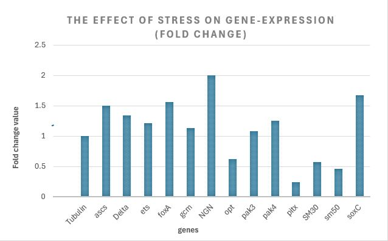

## **qPCR Data Analysis Protocol - Step-by-Step Guide to qPCR Data Analysis: From Raw *C*t to Fold Change**
#### **Livak Method (Livak & Schmittgen, 2001)** 

### **Introduction:**

The Necessity of Post-qPCR Data Analysis:

Following a qPCR run analyzing gene reactions for stressors or inhibitors, we obtain outputs raw Cycle Threshold (*C*t) values. These values reflect initial cDNA transcript abundance, but they cannot be directly compared or interpreted biologically, due to inherent experimental variations. 

To extract meaningful scientific insights, processing raw data through the calculation method is essential for understanding the gene reaction under stress conditions, compare to normal conditions.

Post-qPCR mathematical processing is required to eliminate technical-background "noises", establish a relative baseline and translate exponential data into true biological trends.

### Preliminary Step: Experimental Setup & Gene Selection
#### **Targeted Genes Defining:** 
Define your target gene(s) of interest and a stable internal reference (housekeeping) gene:

:memo: Reference (housekeeping) gene: a stable gene which the known stressor/factor we chose to check will not effect it.

:memo: Target gene: gene or genes that we expect to react upon known stressor/factor.

#### **Experimental Design:** 
Design and conduct a controlled experiment consisting of:

:memo: Experimental/Treatment Group: Exposed to the specific stressor/inhibitor.

:memo: Control Group: Keep under unstressed conditions.

#### **Quantification:**
Perform quantitative PCR (qPCR) to obtain raw cycle threshold (Ct) values for all samples.

##### Arrange the result of the qPCR in table:

### Table 1: Cycle Threshold (Ct) - an example

| Treatment | Tubulin1 | ascs | Delta | ets | foxA | gcm | NGN | opt | pak3 | pak4 | pitx | SM30 | sm50 | soxC | synB |
| :--- | :---: | :---: | :---: | :---: | :---: | :---: | :---: | :---: | :---: | :---: | :---: | :---: | :---: | :---: | :---: |
| **DMSO Control** | 23.30 | 29.09 | 25.96 | 24.72 | 24.37 | 28.35 | 28.35 | 31.02 | 25.41 | 25.57 | 29.68 | 20.97 | 23.70 | 25.07 | 24.13 |
| **Inhibitor treatment** | 23.30 | 28.51 | 25.54 | 24.44 | 23.72 | 28.18 | 27.35 | 31.71 | 25.29 | 25.25 | 31.72 | 21.77 | 24.81 | 24.33 | 24.06 |

1 Reference gene

### **Step 1: Internal Data Normalization (Δ*C*t)**
#### **Normalize the target gene expression against the internal reference gene to account for variations in initial cDNA template concentration.**
**Minor variations in RNA quality, reverse transcription efficiency and/or pipetting are inevitable. Subtracting the Ct values of a stable reference gene (e.g., Tubulin) from the target gene controls for these confounding factors, ensuring that observed differences reflect true biological responses rather than technical artifacts.**

Calculated Parameter: Δ*C*t

*Formula:*

$$
\Delta C_t = C_{t\text{ target}} - C_{t\text{ reference}}
$$

Example:

***Tubulin*** DMSO Control = 23.30

***ascs*** DMSO Control = 29.09

DMSO Control (Δ𝐶𝑡) = 29.09 - 23.30 = **5.798**

***Tubulin*** Inhibtior treatment = 23.30 (the right reference gene - no change under stress treatment)

***ascs*** Inhibtior treatment = 28.51 (a clear difference between control and stress treatment)

Inhibtior treatment (Δ𝐶𝑡) = 28.51 - 23.30 = **5.213**

As shown in the table 2:

### **Table 2: ΔCt calculation**

| Treatment | *Tubulin* | *ascs* | *Delta* | *ets* | *foxA* | *gcm* | *NGN* | *opt* | *pak3* | *pak4* | *pitx* | *SM30* | *sm50* | *soxC* | *synB* |
| :--- | :---: | :---: | :---: | :---: | :---: | :---: | :---: | :---: | :---: | :---: | :---: | :---: | :---: | :---: | :---: |
| **DMSO Control ΔCt** | 0.000 | 5.798 | 2.668 | 1.421 | 1.070 | 5.059 | 5.056 | 7.725 | 2.110 | 2.276 | 6.383 | -2.327 | 0.405 | 1.777 | 0.831 |
| **Inhibtior treatment ΔCt** | 0.000 | 5.213 | 2.242 | 1.142 | 0.427 | 4.883 | 4.057 | 8.413 | 1.999 | 1.957 | 8.429 | -1.529 | 1.515 | 1.032 | 0.764 |

### **Step 2: Normalization to the Control Group (ΔΔCt)**
#### **Calculate the relative change of the target gene within the stress treatment group compared to its baseline expression in the control group.**
**Baseline Comparison (ΔΔCt): *Gene expression changes are relative*. Subtracting the baseline expression of the control group (e.g., DMSO control) from the experimental group, isolates the net effect of the treatment.**

Calculated Parameter: ΔΔCt

*Formula:*

$$
\Delta\Delta C_t = \Delta C_{t\text{ experimental}} - \Delta C_{t\text{ control}}
$$

Note: Typically, the average ΔCt of the control group is subtracted from each individual sample's ΔCt.

Example 

***ascs*** gene:

DMSO Control (Δ𝐶𝑡) = 5.798 

Inhibtior treartment (Δ𝐶𝑡) = 5.213 

ΔΔ𝐶𝑡 = 5.213 - 5.798 = **-0.585**

As shown in table 3:

### **Table 3: ΔΔCt calculation**

| Parameter | *Tubulin* | *ascs* | *Delta* | *ets* | *foxA* | *gcm* | *NGN* | *opt* | *pak3* | *pak4* | *pitx* | *SM30* | *sm50* | *soxC* | *synB* |
| :--- | :---: | :---: | :---: | :---: | :---: | :---: | :---: | :---: | :---: | :---: | :---: | :---: | :---: | :---: | :---: |
| **ΔΔCt** | 0.000 | -0.585 | -0.426 | -0.279 | -0.643 | -0.176 | -0.998 | 0.688 | -0.111 | -0.319 | 2.046 | 0.798 | 1.111 | -0.744 | -0.067 |

##### **Step 3: Calculation of Relative Expression = Fold Change**

**Convert the logarithmic ΔΔCt value into a linear value representing the exponential amplification of the PCR process.**

**Because PCR amplification is exponential, *C*t values exist on a logarithmic scale (where a difference of 1 cycle represents a 2-fold change). Utilizing the $2^{-ΔΔCt}$ equation transforms these values into a linear Fold Change scale, providing an intuitive, publishable measure of gene upregulation or downregulation.**

Calculated Parameter: Fold Change (Relative mRNA Expression)

*Formula:*

$$
\text{Fold Change} = 2^{(-\Delta\Delta C_t)}
$$

Example 

***ascs*** gene fold change:

**ΔΔCt** = -0.585

Fold change = 2^(-0.585) = **1.50**

As shown in table 4:

### **Table 3: Fold change calculation**

| Parameter | *Tubulin* | *ascs* | *Delta* | *ets* | *foxA* | *gcm* | *NGN* | *opt* | *pak3* | *pak4* | *pitx* | *SM30* | *sm50* | *soxC* | *synB* |
| :--- | :---: | :---: | :---: | :---: | :---: | :---: | :---: | :---: | :---: | :---: | :---: | :---: | :---: | :---: | :---: |
| **Fold change** | 1.00 | 1.50 | 1.34 | 1.21 | 1.56 | 1.13 | 2.00 | 0.62 | 1.08 | 1.25 | 0.24 | 0.58 | 0.46 | 1.68 | 1.05 |

##### **Step 4: Data Visualization and Biological Interpretation**
**Generate a graphical representation (e.g., a bar chart) displaying gene expression levels under the tested stress condition.
(X-axis: Experimental Groups [targeted genes]; Y-axis: Fold Change).**

### **Graph 1: Fold change results**

Looking at the bar chart, you can see which genes were upregulated / downregulated: 

Fold change = 1 : **inhibitor / stress have no effect on gene expression**. Reference gene's fold change should be = 1.

Fold change > 1 : **gene expression increased** (upregulated) under stress compared to the control.

Fold change < 1 : **gene expression decreased** (downregulated) under stress compared to the control.

